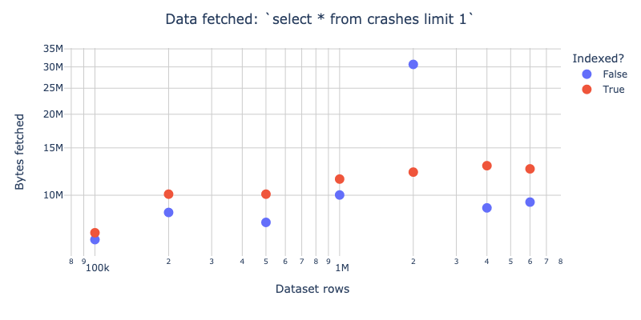
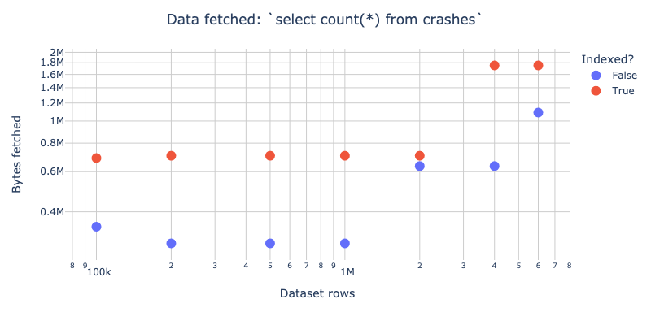

# duckdb-wasm-test
Measure data fetched when [duckdb-wasm] queries `.duckdb` files in S3

## Examples

### Fetch 1 row
Fetch 1 row from each of several `s3://duckdb-wasm-test/*.duckdb` files in S3:

(see [fetch-1/](fetch-1/))

### Fetch 1 row with a specific `id`


(see [select-1/](select-1/))

### Count rows

(see [count-star/](count-star/))

## Methods

### 1. Perform queries, download `.har` file

```bash
npm install
next dev
```

Open the resulting server (likely at http://localhost:3000/), or visit [runsascoded.com/duckdb-wasm-test](https://runsascoded.com/duckdb-wasm-test/):


1. Enter query
1. Clear "Network" tab
1. Filter: ".duckdb"
1. "Disable cache" ✅
1. "Run all"
1. Download .har file

### 2. Analyze `.har` file
Move `.har` file to this directory, and give it a name, e.g. the examples in this repo were generated from `.har`s named:
- `fetch-1.har` (see [fetch-1/](fetch-1): `select * from crashes limit 1`)
- `select-1.har` (see [select-1/](select-1): `select * from crashes where id=50000`)
- `count-star.har` (see [count-star/](count-star): `select count(*) from crashes`)

(the `.har`s themselves are `.gitignore`d, as they're pretty large)

Then run [analyze-reqs.ipynb](analyze-reqs.ipynb) on it:

```bash
name=fetch-1  # use your .har file's stem
query=…       # query you entered in step 1. above

pip install -r requirements.txt
mkdir -p "$name"
echo "$query" > "$name/query.sql"
nb=analyze-reqs.ipynb
papermill -p name "$name" $nb "$name/$nb"
```

The `$name/` directory will contain a `fetched.png` like the plots above.

[duckdb-wasm]: https://github.com/duckdb/duckdb-wasm
